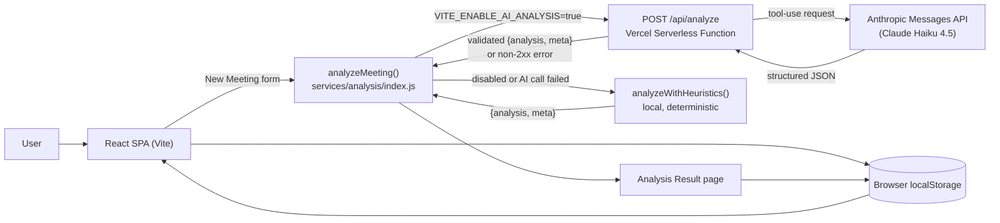

# MeetMind AI

MeetMind AI turns a meeting transcript or recording into a structured, actionable summary — decisions, owners, deadlines, and next steps — in seconds instead of buried in notes.

You paste a transcript (or attach an audio file), and MeetMind AI produces a clear summary, a list of key decisions, a checklist of action items with owners and due dates, a sentiment/engagement snapshot, and a suggested next-meeting agenda — organized in the same dashboard where you can browse and search every meeting you've analyzed.

## Table of Contents

- [Problem](#problem)
- [Solution](#solution)
- [Key Features](#key-features)
- [AI Integration](#ai-integration)
- [Architecture](#architecture)
- [Tech Stack](#tech-stack)
- [How It Works](#how-it-works)
- [Demo Data](#demo-data)
- [Local Setup](#local-setup)
- [Production / Live Demo](#production--live-demo)
- [Screenshots](#screenshots)
- [Project Context](#project-context)

## Problem

Meetings routinely produce more value than anyone retains. Decisions get made verbally and never written down. Action items get mentioned in passing and forgotten by the time everyone's back at their desk. Ownership is ambiguous — "someone should look into that" rarely becomes a tracked task with a name and a date attached. A week later, nobody can say for certain what was agreed, who owns what, or what the follow-up plan was supposed to be. The meeting happened; the outcome didn't survive it.

## Solution

MeetMind AI treats a meeting's raw content — a pasted transcript today, an audio recording as an input mode already in the UI — as structured data to be extracted, not just text to be stored. Instead of a wall of notes, you get a consistent, scannable breakdown: what was discussed, what was decided, who owes what and by when, how the room felt, and what should happen next. Every analyzed meeting lands in a searchable history, so the record of a decision is as easy to find later as the decision was to make in the first place.

## Key Features

Every item below is implemented and verified against the current codebase — nothing here is aspirational.

- **AI-generated meeting summary** — a concise, grounded synopsis of what was actually discussed.
- **Key decisions extraction** — explicit decisions pulled out and listed individually.
- **Action items with owner and due date** — each item shows who's responsible and when it's due, with an interactive checklist and live completion progress bar.
- **Sentiment & engagement insights** — overall tone (Positive / Neutral / Mixed), an engagement score, and a talk-time balance summary.
- **Next-meeting suggestions** — a suggested date/time plus a short follow-up agenda.
- **Participant tracking** — participant count and attendee initials shown throughout the UI.
- **Two input modes** — paste a transcript directly, or attach an audio file. *(Audio upload is a file-selection UI only — there is no real speech-to-text transcription implemented; audio submissions are analyzed without transcript content and fall back accordingly.)*
- **Meeting History** — every analyzed meeting, searchable by title or category, grouped into This Week / Last Week / Earlier.
- **Dashboard overview** — quick-glance stats and your most recent meetings, one click from a fresh analysis.
- **Local persistence** — meetings you analyze are saved in the browser via `localStorage` and appear in both the Dashboard and History immediately, including after a refresh.
- **Responsive layout** — a full sidebar on desktop, a bottom tab bar on mobile.

**Not implemented** (see [Demo Data](#demo-data) and the note below): user accounts/authentication, a backend database, real-time or automatic audio transcription, calendar/Slack/Zoom integrations, multi-user collaboration, or a functioning Settings page (currently a placeholder route).

## AI Integration

The production deployment uses the **Anthropic API**, called **server-side only**, to perform the real analysis.

**Flow:**

1. The **New Meeting** form (`src/pages/NewMeeting.jsx`) collects a title, optional date/participant count, and a transcript.
2. It calls a single dispatcher, `analyzeMeeting()` (`src/services/analysis/index.js`), which decides between the AI provider and the local fallback based on a client-safe feature flag (`VITE_ENABLE_AI_ANALYSIS`).
3. When enabled, the client (`src/services/analysis/aiProvider.js`) sends a `POST` request to the app's own `/api/analyze` endpoint — never to Anthropic directly.
4. `/api/analyze` (`api/analyze.js`) is a Vercel serverless function. It reads `ANTHROPIC_API_KEY` from a **server-side environment variable**, then calls the Anthropic Messages API (model: **Claude Haiku 4.5**) using a forced tool-call so the model returns strictly structured JSON matching MeetMind's schema — summary, key decisions, action items, sentiment/engagement, and a next-meeting suggestion.
5. The server **strictly validates** every field of the model's response before returning it. Any failure — missing key, no transcript content, a network error, an Anthropic error, or a response that doesn't validate — returns a non-2xx status instead of passing through unvalidated data.
6. The client receives the validated result and renders it on the **Analysis Result** page, unaware of (and unaffected by) whether that result came from the AI or the fallback.

**Security:** `ANTHROPIC_API_KEY` is stored exclusively as a server-side environment variable in the Vercel project's settings. It is never prefixed with `VITE_`, never included in the client bundle, and never committed to the repository (`.env`, `.env.local`, and `.env*` are git-ignored, with a `.env.example` template kept as the only tracked reference).

**Heuristic fallback:** MeetMind AI also includes a local, deterministic analysis engine (`src/services/analysis/heuristicProvider.js`) that uses keyword and pattern matching over the transcript text — no network call, no cost, no dependency on the AI provider. This is **not** an AI implementation; it's a rule-based approximation that exists specifically so the app keeps working if the AI provider is disabled, unreachable, or returns something that fails validation. It's the default when `VITE_ENABLE_AI_ANALYSIS` is unset, and it's the automatic fallback on any AI request failure.

## Architecture



The React app never talks to Anthropic directly, and the API key never leaves the serverless function.

## Tech Stack

Determined directly from `package.json` and the repository layout:

- **Frontend:** React 19, React Router 7, Vite
- **Styling:** Tailwind CSS 4 (via `@tailwindcss/vite`)
- **Backend:** a single Vercel serverless function (`api/analyze.js`), plain Node.js using the native `fetch` API — no server framework, no ORM
- **AI Provider:** Anthropic API (Messages API, tool-use / structured output), model `claude-haiku-4-5-20251001`
- **Persistence:** browser `localStorage` (no database)
- **Tooling:** oxlint for linting; no TypeScript — plain JavaScript/JSX throughout
- **Hosting:** Vercel

## How It Works

1. Open the **Dashboard** — see summary stats and your most recent meetings.
2. Click **New Meeting**.
3. Enter a meeting title (required), and optionally a date and participant count.
4. Paste a transcript, or switch to **Upload Audio** and attach a file.
5. Click **Analyze Meeting**.
6. MeetMind AI generates the analysis — via the live Anthropic integration if configured, or the local heuristic engine otherwise — and you land on the **Analysis Result** page.
7. Review the summary, check off action items as you complete them, see key decisions and the suggested next meeting.
8. The meeting is saved locally and now appears in both **Dashboard** and **History**, searchable at any time.

## Demo Data

To make the interface meaningful on first load, MeetMind AI ships with **10 pre-populated demo meetings** (`src/constants/meetings.js`, `src/constants/analysisContent.js`) with hand-written, realistic-looking analysis content, and **static dashboard statistics** (`src/constants/dashboardData.js`): "Meetings Analyzed: 12", "Action Items Found: 47", "Hours Saved: 8.5", each with a trend label.

**These numbers are fixed, hardcoded demonstration values used to showcase the interface — they are not derived from real usage and should not be interpreted as production metrics.**

Meetings you submit yourself through **New Meeting** are different: they run through the real analysis pipeline described in [AI Integration](#ai-integration) — the live Anthropic path in production when configured, with the heuristic engine as an automatic fallback — and are saved locally alongside the demo data.

## Local Setup

```bash
git clone https://github.com/zekiyebayrk-sketch/MeetMind-AI.git
cd MeetMind-AI
npm install
npm run dev
```

This runs the app fully functional with the local heuristic analysis engine — no API key required.

**To exercise the real Anthropic integration locally**, note that plain `vite dev` does not execute `/api` serverless functions; you need the Vercel CLI (`vercel dev`) or a deployment. Create a `.env` (or `.env.local`) file at the project root — it's already excluded from version control:

```bash
# .env
VITE_ENABLE_AI_ANALYSIS=true
ANTHROPIC_API_KEY=your_api_key_here
```

Other available scripts (from `package.json`):

```bash
npm run build     # production build
npm run preview   # preview the production build locally
npm run lint       # run oxlint
```

## Production / Live Demo

**[https://meet-mind-ai-kappa.vercel.app](https://meet-mind-ai-kappa.vercel.app)**

## Screenshots

*Screenshots will be added here.*

- [ ] Dashboard
- [ ] New Meeting form
- [ ] Analysis Result page
- [ ] Meeting History

## Project Context

MeetMind AI was developed as a project for the **Microsoft AI Innovators Internship**.
